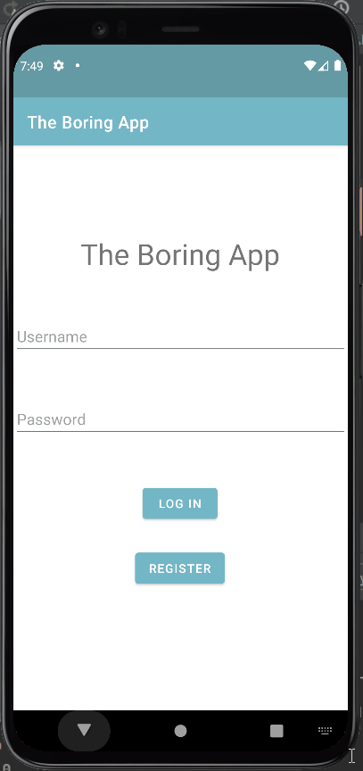

Original App Design Project - README Template
===

# The Boring App

## Table of Contents
1. [Overview](#Overview)
1. [Product Spec](#Product-Spec)
1. [Wireframes](#Wireframes)
2. [Schema](#Schema)

## Overview
### Description
Mobile app for planning events that cater to the needs, budgets, and availabilities of all members of a group. We were tired of not being able to choose something to do with our friends, so we decided to take it into our own hands.

### App Evaluation
- **Category:**
    - Social media / Lifestyle
- **Mobile:**
    - Android
- **Story:**
    - It's hard thinking of something to do that fits everyone's constraints, so BoredAPI will do it instead.
- **Market:**
    - This app is available to any user of any demographic group. Users of all backgrounds are encouraged to participate and find new activities.
- **Habit:**
    - Any time friends want something to do together, The Boring app will shine!
- **Scope:**
    - We are limiting the choices to group activities, since this app is mainly focused on bringing friend groups closer together.

## Product Spec

## Sprint 1 gif

## Sprint 2 gif

### 1. User Stories (Required and Optional)

**Required Must-have Stories**

- [X] Show a list of activities users that they can do in home screen
- [X] User must be able to see information about activities (price, type, accessibility, etc)
- [X] A login screen which requires a username and password
- [X] A register screen that users can sign up
- [X] A navigation bar to switch betweens screen

**Optional Nice-to-have Stories**
- [X] Users must be able to add friends to their account
- [X] Users can filter activities by price, number of participants, type, accessibility, etc.
- [X] User can enter a type of activity they are interested in and get a list of related activities in that category
- [X] Users can add activities to database
- [X] Users can get a random activity
- [ ] Ability to see your friends' searched activities
- [X] Users should have a profile that shows
    - [ ] Preferred activity type
    - [ ] Preferred price range

### 2. Screen Archetypes

* Login - User logs into their account using their username and password
* Register - User signs up or logs into their account
   * Upon Download/Reopening of the application, the user is prompted to log in to gain access to their profile information
   * Information will be stored in a database
* Main Activity - Recycleview of activities showing relevant information
* Extra
    * Profile with picture and user preferences for activities

### 3. Navigation

**Tab Navigation** (Tab to Screen)

* Friends
    * Brings you to the page showing information about your friends
    * Also where you add and remove friends
* Profile
    * Updates profile information and able to logout
* Search
    * Brings you to the page where you can search activities

**Flow Navigation** (Screen to Screen)

* Login: Username and Password fields, log in button
    * Log in: Logs user in, goes to Main
* Register: Username and Password fields, sign up button 
    * Sign Up: Creates account for user, goes to Main
* Main: List of activities with a search bar that has a Friends and Profile button

   * Activity: shows new screen with more details on that specific activity
   * Friends: shows new screen with information about your Friends
   * Search: shows new screen with detailed search options
   * Profile: shows new screen with information about your account
   * Sign out: logs user out, returns to login screen
   * Back: exits application
* Activity: Detailed view of activity
    * Back: returns to main screen
* Friends: Show a list of friends with their profile information
    * Add: Search for an user to add as friend
    * Accept: Accpet friend request
    * Remove: Remove an user from your list of friends
* Search: Text field where you can enter an activity
    * Once activity is entered, see a list of the related activities
    * Back: returns to main screen
* Profile: Show an overview of the signed-in user's profile
    * Can see their history of searches
    * Back: returns to main screen

## Wireframes

### [BONUS] Digital Wireframes & Mockups

### [BONUS] Interactive Prototype

## Schema 
### Models
Model: User
   | Property      | Type     | Description |
   | ------------- | -------- | ------------|
   | Username      | String   | Name to display when user posts something|
   | Password      | String   | Required for user to login |
   | Profile pic   | File     | Image for user's profile |
   | objectID       | String   | Unique value the server binds to user |
   | Friends List  | MutableList<User>   | List of users that stores all of their friends |
   | createdAt     | DateTime | date when the user created their account |
   
Model: Activity
   | Property      | Type     | Description |
   | ------------- | -------- | ------------|
   | Activity      | String   | Description of the queried activity|
   | Type          | String   | Type of the activity ["education",                                           "recreational", "social", "diy", "charity",                                   "cooking", "relaxation","music", "busywork"]|
   | Participants  | Int      | The number of people that this activity could                                 involve [0, n]|
   | Price Range   | Double   | A factor describing the cost of the event                                     with zero being free [0, 1] |
   | Link          | String   | number of comments that has been posted to an                                 image |
   | Key           | String   | number of likes for the post |
   | Accessibility | Int      | A factor describing how possible an event is                                 to do with zero being the most accessible                                     [0.0, 1.0] |

### Networking
- Login:
    - (Read/GET) Compare input against database of username/password combinations

- Register:
    - (Create/POST) Create new User object in the database with the corresponding password

- Main feed:
    - (Read/GET) fetching data from TheBored API. 

- Search Screen:
    - (Read/GET) Query BoredAPI for list of Activities matching search parameters to display in main

- Detailed Activity:
    - (Read/GET) The categories of each activity like price, accessibility, image etc.

- Friends List:
    - (Read/GET) Display a list of friends
    - (Create/POST) Add a friend
    - (Delete) Remove a friend

- Profile:
    - (Read/GET) Display user’s name, profile image, and description
    - (Update) Change the user’s profile image
    - (Update) Update the profile description

    
### Endpoints
   | HTTP Verb | Endpoints         | Description      |
   | ----------| ------------------| ------------     |
   | GET       | ?type=:input_type | Get activity of a certain type|
   | GET       | ?participants=:participants| Find activity with a certain number of participants |
   | GET       | nothing after the base url     | Get a random activity |
   | GET       | ?price=input_price   | Get activity that is at a certain “expense level” |
   | GET       | ?accessibility=:accessibility   | Find an activity with a specified accessibility |
